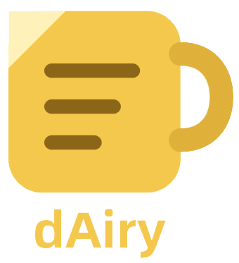
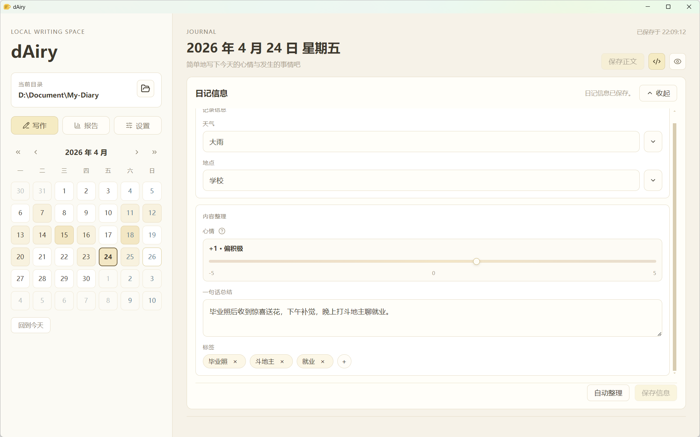
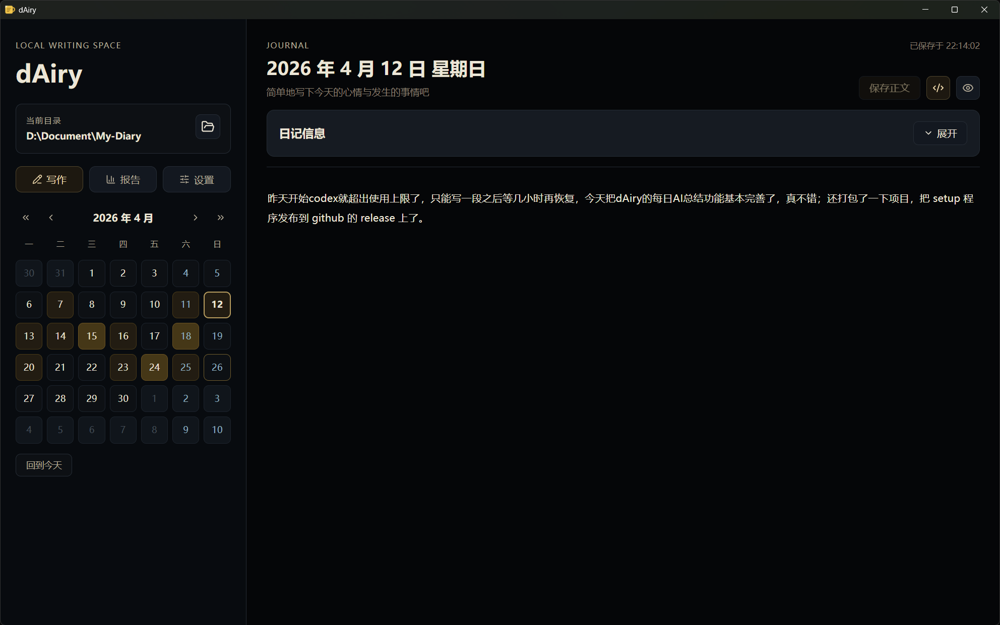
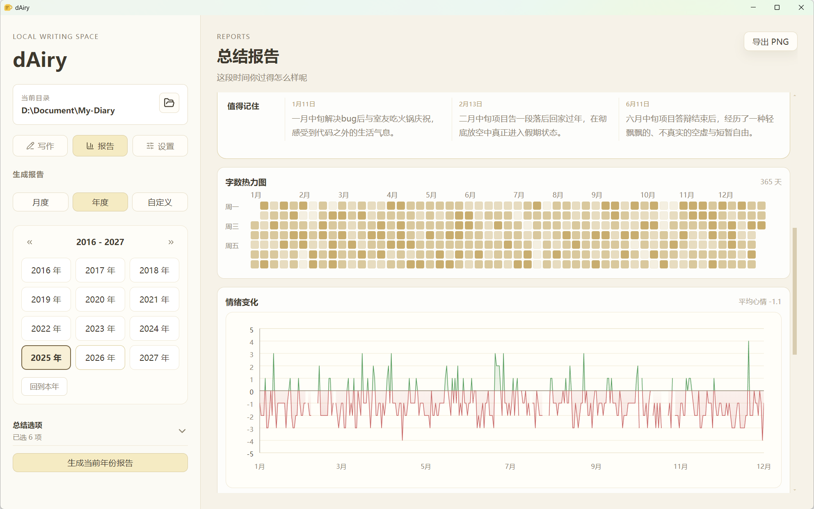
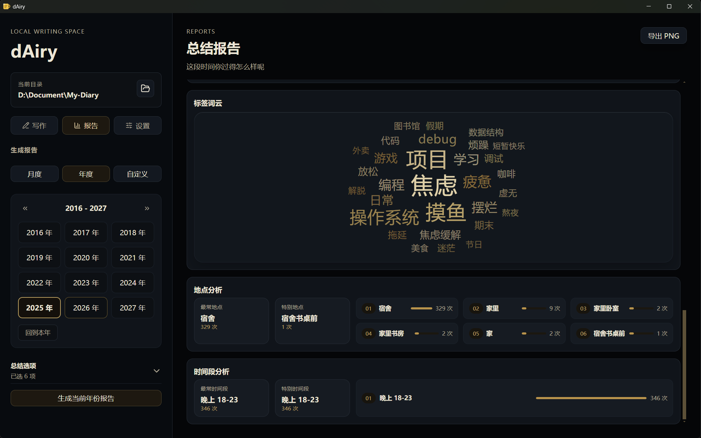

<p align="center">
	
</p>


# 简介

`dAiry` 是一个面向日常写作场景的桌面应用。它以本地 Markdown 为核心，提供轻量写作、AI 辅助整理，以及月报、年报、自定义区间总结等能力，适合每天结束时写下几十个字快速总结。

> [!tip]
>
> 代码均由 codex 编写，可以认为是一个 vibe coding 小玩具；
>
> 应用无后端，所有操作均在本地实现，AI 功能的使用需要在应用内配置 API KEY；
>
> 应用不提供云同步功能，可自行使用 **git** 或**坚果云**等方式云同步。推荐使用坚果云桌面端，直接选定整个日记文件夹同步，后续就不需要再管了。

# 特色

**接入 LLM，做简单直接的日/月/年度总结。**

- 当写完日记后，点击`自动整理`，LLM 会根据日记内容生成`一句话总结`，并给出一个`心情分数`。
- 自动生成月/年度总结，LLM 会给出这段时间的`一段话概览`，并从`推进`、`阻塞`、`值得记住`这3个维度给出重点事件。

# 功能

- 🗂️ 本地工作区管理，日记按日期保存为 Markdown 文件
- 📝 支持今日写作、历史浏览、月历切换、Markdown 预览
- 🏷️ 支持天气、地点、心情、总结、标签等 frontmatter 信息维护
- ✨ 支持 AI 自动整理正文，生成总结、标签与心情建议
- 📊 支持月报、年报与自定义区间报告
- 🔥 支持字数热力图、情绪趋势、标签词云等可视化摘要
- 🖼️ 支持将报告导出为 PNG
- 🌙 支持切换深色模式与浅色模式

# 预览









# 下载

请到[发布页面](https://github.com/Criel14/dAiry/releases)下载对应的安装包

# 开发与构建

```bash
npm install
npm run dev
npm run build
```

# 开源协议

本项目采用 MIT License，详见 [LICENSE](https://github.com/Criel14/dAiry/blob/main/LICENSE) 文件
