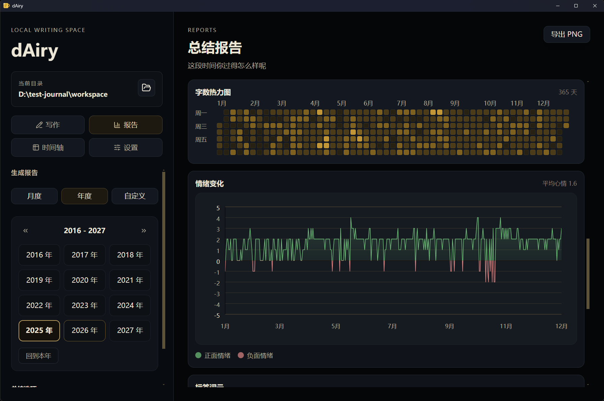

<p align="center">
	
</p>


## 简介

`dAiry` 是一个面向日常写作场景的桌面应用。它以本地 Markdown 为核心，提供轻量写作、AI 辅助整理，以及月报、年报、自定义区间总结等能力，适合每天结束时写下几十个字快速总结。

此外，还提供了 MCP 服务，可以接入本地聊天工具，用于日记信息的搜索与发现，

> [!tip]
>
> Vibe Coding 作品，先后使用了 gpt5.3-codex, gpt5.4, deepseek v4 pro, kimi k3 等模型；CLI 使用了 Codex 和 OpenCode
>
> 应用无后端，所有操作均在本地实现，AI 功能的使用需要在应用内配置 API KEY；
>
> 应用不提供云同步功能，可自行使用 **Git**、**OneDrive**或**坚果云**等方式自行云同步。

## 下载

请到[发布页面](https://github.com/Criel14/dAiry/releases)下载最新的安装程序

## 预览

应用界面：

.png)

.png)



接入 OpenCode 示例：

.png)

## 特色

- AI 整理，生成可视化年报/月报、大事件时间轴等，一目了然


- MCP 服务，给予 AI 聊天工具对日记的读写功能

## 功能

- 📝 支持今日写作、历史浏览、月历切换、Markdown 预览，日记按日期保存为 Markdown 文件
- 🏷️ 支持天气、地点、心情、总结、标签等 frontmatter 信息维护
- ✨ 支持 AI 自动整理正文，生成总结、标签与心情建议
- ⌛ 支持 AI 自动提取事件，形成年度大事件"时间轴"报告
- 📊 支持月报、年报与自定义区间报告，生成支持字数热力图、情绪趋势、标签词云等可视化摘要，支持将报告导出为 PNG

## SKILL 与 MCP

### 日记撰写

> 项目没有后端，也没有手机端，想要在电脑不在身边的时候撰写日记，得使用一些其他方法

项目里提供了一个 SKILL: [dairy-journal-writer](https://github.com/Criel14/dAiry/blob/main/docs/skills/dairy-journal-writer)  ，可以使用手机连接 OpenClaw，即可远程实现每日日记的编写、日记信息整理；（不支持月/年度总结以及其他信息的整理）

使用前请修改 `SKILL.md` 中的**工作区目录**：

```
<WORKSPACE> = 存放日记文件的目录
```

同时提供了以下的工具供 AI 使用：

| 工具 | 说明 |
|------|------|
| `dairy_write_entry` | 完整写入日记：正文落盘 → 主进程 AI 自动整理回填 summary/tags/mood → 异步触发画像日更与时间轴日更 |
| `dairy_generate_report` | 异步触发区间报告生成，立即返回 reportId；生成需几分钟，完成后落盘 `reports/` |
| `dairy_read_report` | 按 reportId 读取已落盘的报告 JSON；尚未生成/仍在生成中返回中文提示 |

### 日记搜索

项目里提供了一个 SKILL: [dairy-life-assistant](https://github.com/Criel14/dAiry/tree/main/docs/skills/dairy-life-assistant)，该 SKILL 用于指导 AI 成为用户的”人生整理助手“，旨在帮助用户回顾日记、回答关于过去经历的问题等。

同时提供了以下的工具供 AI 使用：

| 工具 | 说明 |
|------|------|
| `dairy_search_entries` | 语义检索日记，返回详尽回答 + 发现（findings）+ 相关日期 + 置信度 |
| `dairy_read_entries` | 按日期批量读取正文与元信息，返回 `entries` + `skippedDates` |
| `dairy_grep_entries` | 关键词字面匹配（仅正文），返回命中日期、摘要与上下文片段 |
| `dairy_read_profile` | 读取最新年份用户画像 Markdown |
| `dairy_read_index` | 年度元索引（摘要/标签/心情/地点/字数） |

### MCP 服务

1. 在应用里点击：设置 - MCP 服务 - 勾选“启用 MCP 服务”，默认连接地址为 `http://127.0.0.1:9123/mcp`，支持自定义；
2. 在聊天工具的配置文件中配置好 MCP 服务，以 OpenCode 为例：

```json
{
	"mcp": {
		"dairy-mcp": {
			"url": "http://127.0.0.1:9123/mcp",
			"type": "remote",
			"enabled": true
		}
	}
}
```

## 开发与构建

```bash
npm install
npm run dev
npm run build
```

## 开源协议

本项目采用 MIT License，详见 [LICENSE](https://github.com/Criel14/dAiry/blob/main/LICENSE) 文件
